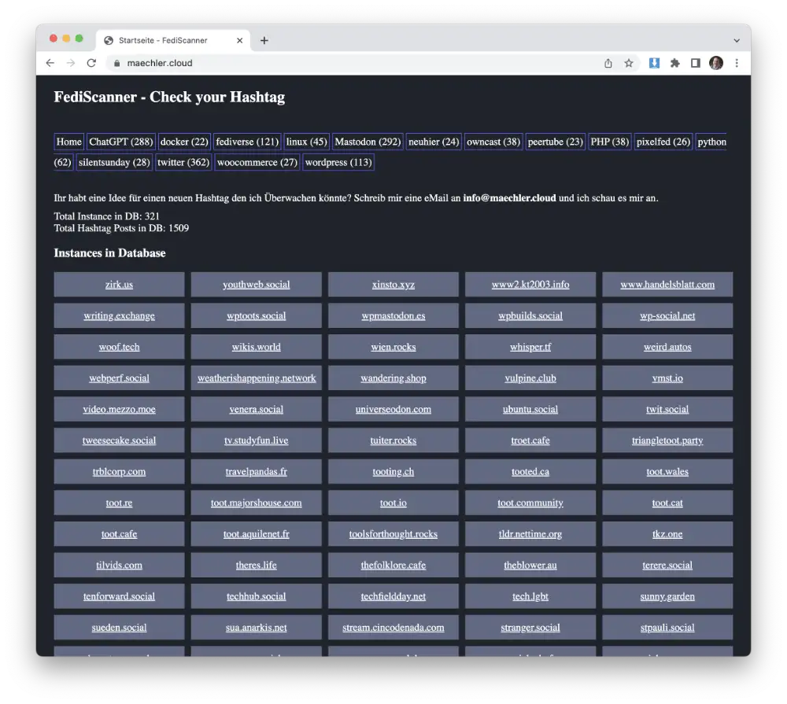
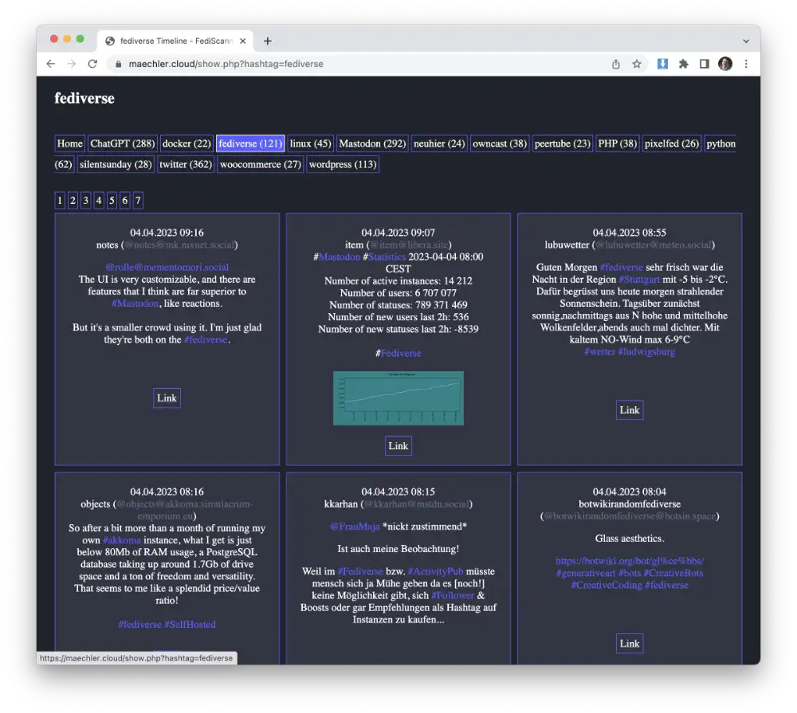

# FediScanner

A Simple PHP Script to crawl Hashtags in the Fediverse

if you have any questions you can contact me directly here
@emaechler@mastodon.maechler.cloud

## Features

- add your desired hashtag
- cronjob
- list of all recorded hashtags
- list of all recorded instance from all fediverse
- simple report system to block posts. admin can check this posts

## Screenshot

this is the start page where you can see a small statistic as well as all recorded instances in fediverse

this is what a hashtag page looks like, you see all the recorded posts from the fediverse that have used this hashtag.

you can see attached pictures as well as videos and if you click on the link you will get to the page of the original post.

## DEMO

[www.fediscanner.info](https://www.fediscanner.info/)

## Install

- Download fediscanner folder
- change database password (/inc/data.php)
- change google stat settings (google.php)
- uploade into your hosting account
- secure /admin/ folder with htaccess / htpasswd
- install cronjob (/inc/crawler.php)
- add some hashtag to your list (/admin/)

enjoy your little tool

## Last Update
Mrz 2024